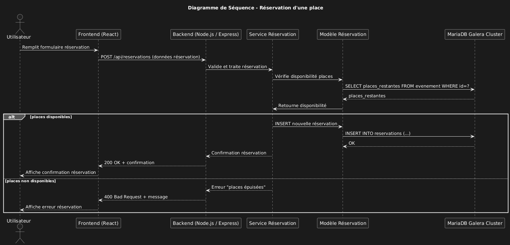
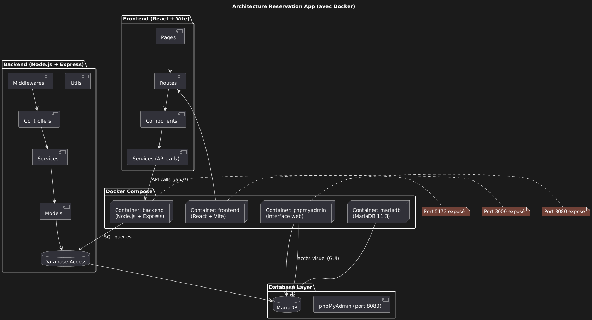
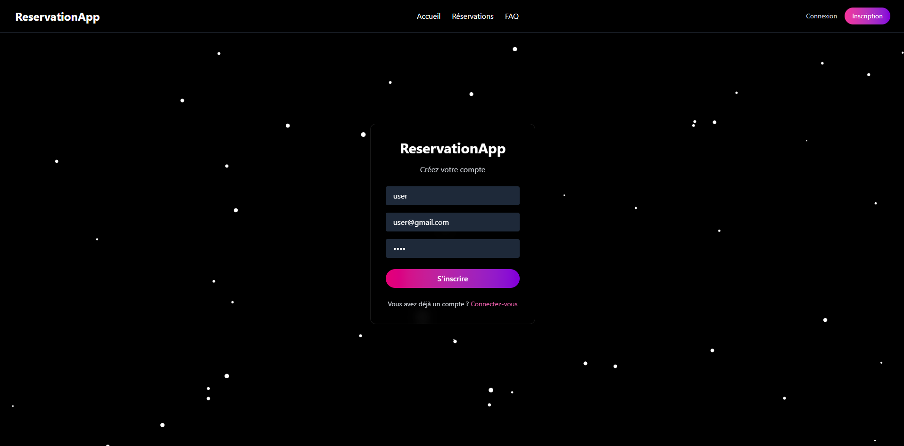
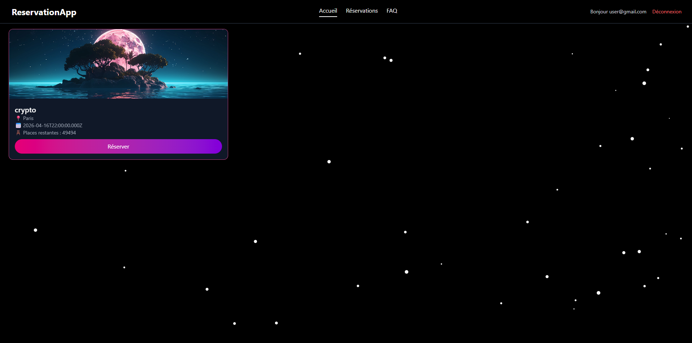
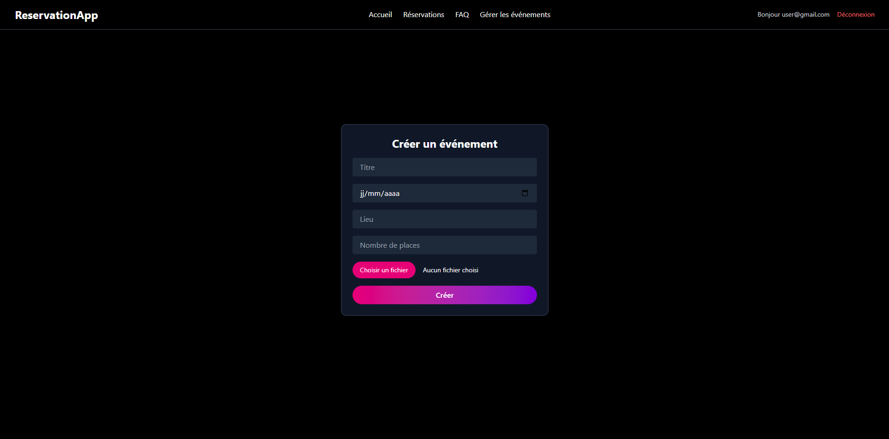
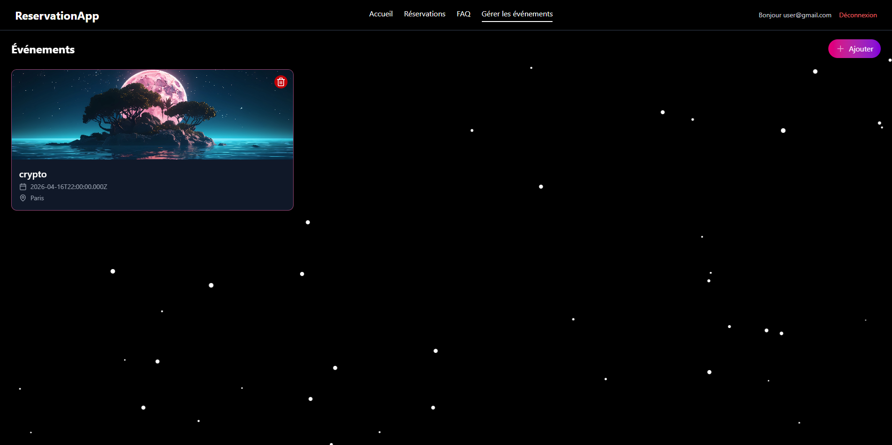

# Reservation App – TP Architecture logicielle & clusters SGBD

## ✨ Description du projet

Cette application permet la réservation de places pour des événements (concerts, conférences, expositions) avec gestion en temps réel du taux de remplissage. Le backend est développé en Node.js avec Express, le frontend en React (Vite.js), et la base de données est une instance MariaDB configurée en cluster Galera. Le projet est entièrement dockerisé.

---

## 📌 Contexte et exigences du TP

* Application de réservation de places pour des événements.
* Contrainte métier : gestion en temps réel du taux de remplissage.
* Cluster Galera pour MariaDB : haute disponibilité.
* Justification de l'architecture (libre).

---

## 🧠 Objectifs pédagogiques

| Thème                | Attendus                                               |
| -------------------- | ------------------------------------------------------ |
| Choix d'architecture | Définir et argumenter (diagrammes, compromis, limites) |
| KISS                 | Code simple et lisible                                 |
| DDD                  | Définition des contextes métiers, entités, agrégats    |
| TDD                  | Tests d'acceptation, unitaires ou de contrat           |
| SOLID                | Application concrète d'au moins un principe            |
| Clusters DB          | Cluster Galera + tests de bascule (failover)           |

---

## 🛡️ Architecture choisie

**Clean Architecture** : organisée autour de cas d'usages et d'entités métier, facilitant évolutions et tests.

### 🔧 Principes appliqués

* **KISS** : responsabilités claires et modules simples.
* **DDD** : logique métier bien délimitée.
* **SOLID** : couplage faible entre couches.
* **TDD** : tests à chaque niveau (logique, intégration, API).

### 📚 Organisation des dossiers (Clean Archi)

* **domain** : entités et logiques métier
* **application** : cas d’usages (création, réservation)
* **infrastructure** : accès BDD, JWT, logs
* **interface** : routes Express, contrôleurs

---

## 📁 Structure du projet (avec Docker)

```
TP_SOLO_ARCHINTIER/
├── backend/
│   ├── Dockerfile
│   ├── .env
│   ├── package.json
│   ├── src/
│   └── ...
│
├── frontend/
│   ├── Dockerfile
│   ├── .env
│   ├── package.json
│   └── src/
│
├── docker-compose.yml
├── .env
├── images/
└── README.md
```

---

## 🐳 Docker & Conteneurs

### 📦 Services définis dans `docker-compose.yml`

* `db` : MariaDB 11.3 (cluster-ready)
* `backend` : API Node.js + Express
* `frontend` : Vite.js + React
* `phpmyadmin` : interface d’administration MariaDB (port 8080)

### 🔒 Variables d’environnement globales (`.env`)

```env
MYSQL_ROOT_PASSWORD=rootpassword
MYSQL_DATABASE=reservation_db
MYSQL_USER=myuser
MYSQL_PASSWORD=mypassword
PORT=3000
```

### 🚀 Lancement complet

```bash
git clone <url_du_repo>
cd TP_SOLO_ARCHINTIER

# Lancer les services Docker
docker-compose up --build
```

### 🔗 Accès aux services

* Frontend : [http://localhost:5173](http://localhost:5173)
* Backend : [http://localhost:3000](http://localhost:3000)
* PhpMyAdmin : [http://localhost:8080](http://localhost:8080)

> Identifiants PhpMyAdmin : root / rootpassword

---

## 🖼️ Fonctionnalités

1. **Connexion utilisateur simple** (username uniquement)
2. **Vue utilisateur** : liste des événements et bouton "Réserver"
3. **Vue admin** : création et suppression d’événements
4. **Stats** : taux de remplissage visible pour chaque événement

---

## 🖼️ Diagrammes d'architecture et de séquence

### 📌 Diagramme d'architecture



### 🔄 Diagramme de séquence (réservation)




## 📸 Aperçu de l'application

Voici un cas d'utilisation présenté sous forme de mini tutoriel illustré avec des captures d'écran pour guider l'utilisateur dans le parcours classique de l'application.

1. **Connexion à l'application**

   * L'utilisateur accède à la page de connexion.
   * Il entre simplement son nom d'utilisateur pour se connecter (pas de mot de passe).
   * 

2. **Interface utilisateur (user)**

   * Une fois connecté, l'utilisateur voit la liste des événements disponibles avec les places restantes.
   * Il peut cliquer sur "Réserver" pour participer à un événement.
   * 


3. **Interface administrateur (admin)**

   * Un administrateur accède à une interface différente après connexion.
   * Il peut créer de nouveaux événements et voir le taux de remplissage.
   * 

4. **Liste des évenements (admin)**

   * L'administrateur peut également voir toutes les  événements spécifique et supprimer.
   * 

---

## 📌 Auteur

Réalisé par **LILJOKER06** – TP "Architecture logicielle & clusters SGBD" – 2024–2025
